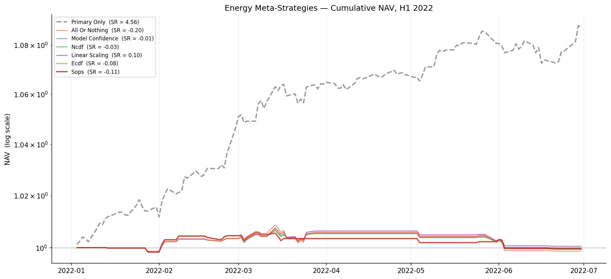

# Energy Signal Metamodel

A probability-weighted filter for systematic trading signals on energy futures, built on triple-barrier labeling and gradient-boosted / neural metamodels.

## Summary

Given a primary trading model's daily directional signals (-1, 0, +1), this project trains a metamodel that sits on top of it. For each signal the metamodel outputs a probability in [0, 1] that following it would be profitable under a triple-barrier exit rule. The primary model decides whether to bet; the metamodel decides whether the bet is worth taking.

The project covers the **Energy** asset class:

| Ticker | Instrument |
|---|---|
| cl1s | WTI crude oil |
| ho1s | Heating oil |
| rb1s | RBOB gasoline |
| ng1s | Natural gas |

Pipeline: feature engineering &rarr; triple-barrier labeling &rarr; per-instrument model training and comparison (linear, tree-based, neural) &rarr; cluster-level feature importance &rarr; out-of-sample evaluation &rarr; optional position-sizing strategy on top of the metamodel probabilities.

## Results



Metamodel-filtered strategies vs. the blind primary-signal baseline over the H1 2022 evaluation window. The evaluation is reported honestly, including where the metamodel does not beat the primary baseline on this window &mdash; see `notebooks/3_final_pipeline.ipynb` and `src/part5/README.md` for the full methodology and threshold-selection rationale.

## Repository structure

```
energy-signal-metamodel/
  README.md
  requirements.txt           pinned dependencies (Python 3.10)
  data_sources.md            provenance and licensing notes for the inputs
  notebooks/
    1_feature_engineering.ipynb          builds the feature matrix
    2a_rbob_gasoline_model_training.ipynb metamodel for rb1s
    2b_heating_oil_model_training.ipynb   metamodel for ho1s
    2c_natural_gas_model_training.ipynb   metamodel for ng1s
    2d_wti_crude_oil_model_training.ipynb metamodel for cl1s
    3_final_pipeline.ipynb               orchestrator, builds the deliverable
    4_strategy_construction.ipynb        position-sizing strategy on top of the metamodel
    sanity_checks.ipynb                  independent label and feature checks
  src/
    part5/                   evaluation layer: thresholding, metrics, vol overlay
  data/
    src/                      raw inputs go here (not included, see data_sources.md)
    processed/features/       features.parquet, feature_dictionary.csv (built by notebook 1)
    deliverables/             predictions.csv, weights.csv, strategy_nav.png
```

## Setup

The code runs top to bottom on CPU under Python 3.10.

```
pip install -r requirements.txt
```

## Data

Raw market data (`ohlcv_data.csv`, `primary_signals.csv`) and a Bloomberg-sourced volatility index (`ovx.csv`) are **not included** in this repository due to data licensing restrictions &mdash; see `data_sources.md` for the schema and how to supply your own. Processed features and model outputs are included since they don't redistribute the licensed raw feed.

## How to run and reproduce the deliverable

`notebooks/3_final_pipeline.ipynb` is the single entry point. Once you've supplied your own `data/src/` inputs (see above), open it and run all cells. It

1. runs every notebook in order, feature engineering (`1`) followed by the four per-instrument metamodels (`2a` to `2d`),
2. assembles the combined CSV at `data/deliverables/predictions.csv`,
3. prints the winning-model comparison and the prediction graphs.

The run-order cell exposes one switch:

- `RUN_NOTEBOOKS = True` does a clean end-to-end run, regenerating features and retraining every metamodel before rebuilding the deliverable.
- `RUN_NOTEBOOKS = False` skips the slow re-execution and rebuilds `predictions.csv` from the per-instrument CSVs already on disk.

The pipeline is fully seeded (Python, NumPy, TensorFlow and Keras, and every scikit-learn and XGBoost estimator all use seed 42), so a clean run reproduces the per-instrument prediction CSVs deterministically.

## Out-of-sample evaluation

The deliverable `predictions.csv` covers H1 2022 (January to June); a further six months (July to December 2022) is held out as a hidden test window not seen during model development. Predicted probabilities are computed only from features known at entry time, with no forward look-up. Triple-barrier labels in the last roughly 20 trading days of the data are dropped rather than computed on a truncated horizon, so the tail of the window is never labelled on a biased path. See Section 8 of each per-instrument notebook and `sanity_checks.ipynb` for the verification.

## Deliverables

**Metamodel predictions.** `data/deliverables/predictions.csv`, one row per (date, instrument, prediction), covering H1 2022 for the four energy instruments. `prediction` is the probability in [0, 1] that the primary signal is worth taking.

```
date,instrument,prediction
2022-01-03,cl1s,0.08
2022-01-03,ho1s,0.63
2022-01-03,ng1s,0.47
2022-01-03,rb1s,0.61
```

The per-instrument `predictions_<ticker>.csv` files are intermediate outputs of notebooks `2a` to `2d`, and `3_final_pipeline.ipynb` merges them into the combined file.

**Strategy weights.** `notebooks/4_strategy_construction.ipynb` turns the metamodel probabilities into a position-sizing strategy and writes `data/deliverables/weights.csv`, one row per (date, instrument, weight), where weight is the signed position (positive long, negative short). This notebook is run separately from the core pipeline in notebook 3.

## Methodology notes

- Walk-forward cross-validation uses chronological `TimeSeriesSplit`. Because consecutive triple-barrier labels overlap by up to 20 days, neighbouring folds can share label paths at the boundary. Chronological splits are used for sample-size reasons and this is reported as a trade-off rather than a leak.
- The deliverable is raw probabilities, not thresholded, so no test-tuned decision threshold leaks into the shipped CSV. The operational threshold used inside the evaluation sections is selected on a leak-free Aug to Dec 2021 slice and frozen for Jan to Jun 2022.
- Results are reported honestly: the evaluation sections flag where the metamodel does not beat the blind primary baseline on H1 2022 rather than hiding it.

## License

MIT &mdash; see `LICENSE`.
